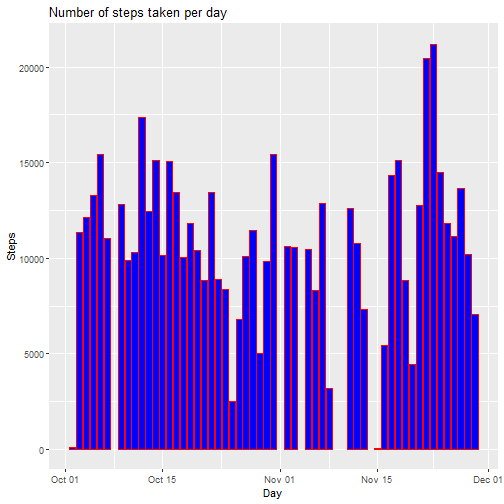
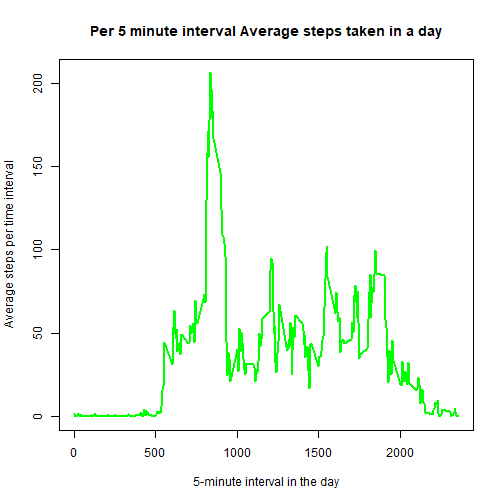
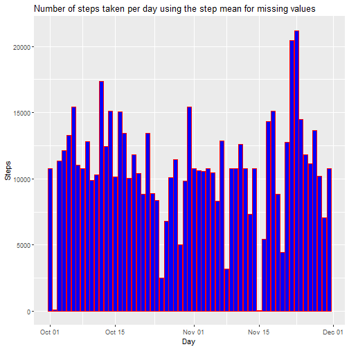
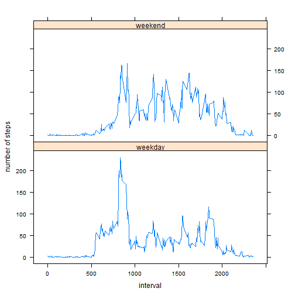

## R markdown document for Reproduceable Research Project 1
###Loading and preprocessing the data
The below R code does the following:

1. Load the data (i.e. read.csv())
2. Process/transform the data (if necessary) into a format suitable for my analysis: 

- tranform the date column form a numeric to a date format
- calculate the number of steps per day


```r
data <- read.csv("activity.csv")
data <- transform(data, date = as.Date(date))
```
###What is mean total number of steps taken per day?
Ignoring the missign values, the code 

1. Calculates the total number of steps taken per day
2. Plots a histogram of the total number of steps taken each day
3. Calculate the mean and median of the total number of steps taken per day


```r
sumdata <- aggregate(steps ~ date, data, sum)
library(ggplot2)
plot <- ggplot(sumdata, aes(sumdata$date, sumdata$steps)) + geom_col(fill="blue", col= "red") + labs(title = "Number of steps taken per day",x= "Day",y="Steps")
meansteps <- format(mean(sumdata$steps), scientific = NA)
mediansteps <- format(median(sumdata$steps), scientific = NA)
suppressWarnings(print(plot))
```



Looking at the average daily steps, the *calculated mean*, rouded to the nearest 2 decimals, is **10766.19** and the *median* is **10765**.

###What is the average daily activity pattern?
Below code makes a time series plot (i.e. type = "l") of the 5-minute interval (x-axis) and the average number of steps taken, averaged across all days (y-axis)


```r
averagedata <- aggregate(steps ~ interval, data, mean)
plot(averagedata$interval, averagedata$steps, type="l", main = "Per 5 minute interval Average steps taken in a day", xlab= "5-minute interval in the day", ylab= "Average steps per time interval", col="green", lwd=2)
```



Below codes picks the interval with the on average maximum number of steps per day.

```r
sorted <- averagedata[rev(order(averagedata$steps)),]
maxsteps <- sorted$steps[1]
maxinterval <- sorted$interval[1]
```

On average across all the days in the dataset, the *maximum number of steps was recorded in interval number* **835**.  The steps peaked at (206.1698113).

###Imputing missing values
Note that there are a number of days/intervals where there are missing values. The presence of missing days may introduce bias into some calculations or summaries of the data.

Below code calculates the total number of missing values in the dataset 

```r
missingvals<-sum(is.na(data$steps))
```
This dataset is missing **2304** values.

To continue the analysis without missing values I copied the data into a new dataset and replaced the missing NA values with the mean of the values of the same step.  I leveraged off the averageData calculated earlier to impute the average step values.


```r
impdata <- data
for (i in 1:length(impdata$steps)){
        if (is.na(impdata$steps[i] == TRUE)){        
        impdata$steps[i] <- averagedata$steps[match(impdata$interval[i],averagedata$interval)]  
        } 
}
```

Below the code and plot of a histogram of the total number of steps taken each day, calculating the mean and median total number of steps taken per day. 


```r
sumimpdata <- aggregate(steps ~ date, impdata, sum)
plot <- ggplot(sumimpdata, aes(sumimpdata$date, sumimpdata$steps)) + geom_col(fill="blue", col= "red") + labs(title = "Number of steps taken per day using the step mean for missing values",x= "Day",y="Steps")
meanimpsteps <- format(mean(sumimpdata$steps), scientific = NA)
medianimpsteps <- format(median(sumimpdata$steps), scientific = NA)
suppressWarnings(print(plot))
```




Looking at the average daily steps, using the data with imputed values, the *calculated mean*, is **10766.19** and the *median* is **10766.19**.

As expected the *mean* of the value set stayed constant at **10766.19** when the missing values where replaced by the mean interval values.  The *median* has increase from **10765** to equal the *mean* at **10766.19**.
Looking at the change in histogram the average for days with many orignal missing values, like 1 October, increase dramatically.  Days like 2 October where there were few missing values and many zero values stayed at a low  reading.

###Are there differences in activity patterns between weekdays and weekends?
Below code classifies the days of the measurements into weekend and weekday..


```r
impdata$wd <- as.factor(ifelse(weekdays(impdata$date) %in% 
                     c("Saturday", "Sunday"), "weekend", "weekday"))
```
Below a panel plot contain a time series plot (i.e. type="l") of the 5-minute interval (x-axis) and the average number of steps taken, averaged across all weekday days or weekend days (y-axis).  The plot shows a significant difference in activity between weekdays and weekends, espcially in the more active intervals.


```r
library(lattice)
aveimpdata <- aggregate(steps ~ interval + wd, impdata, mean)
par(mfrow=c(2,1))

xyplot(steps ~ interval | wd, 
       data = aveimpdata, 
       type = "l", 
       layout = c(1, 2), 
       xlab = "interval", 
       ylab = "number of steps")
```




